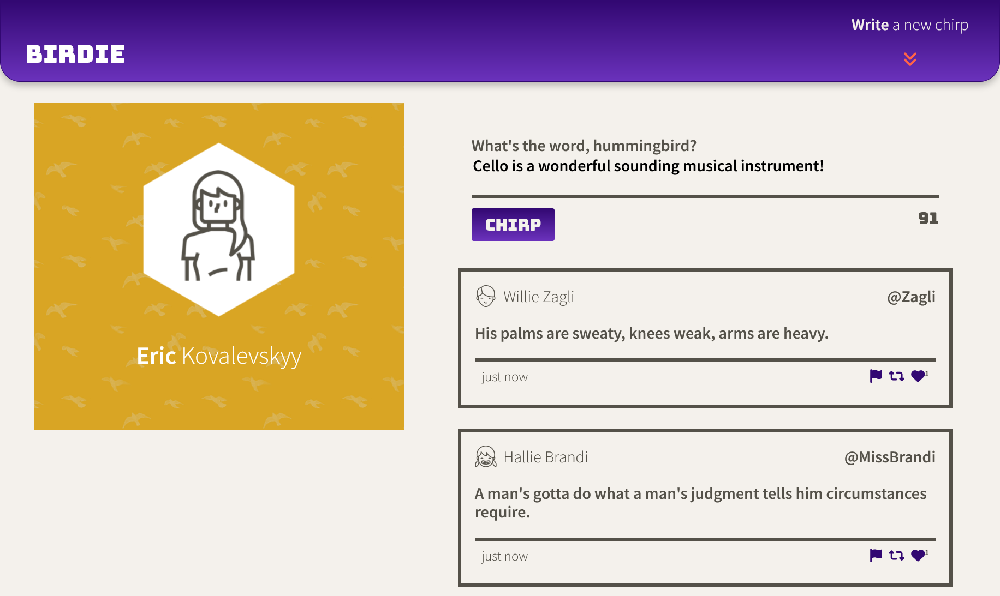
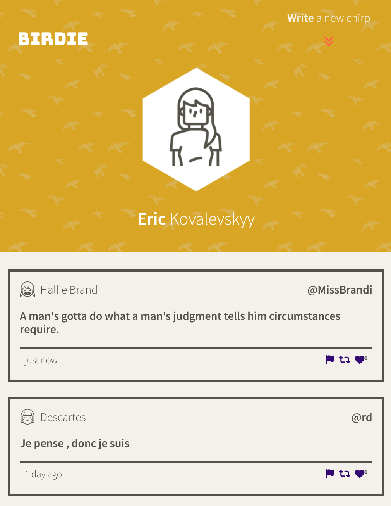

# Birdie Project

Birdie (a.k.a. Tweeter) is a simple, single-page Twitter clone. Its main goal was front end implementation, built on top of a pre-built backend framework. It uses jQuery, HTML5, and CSS3, and used SASS for preprocessing the CSS.

## At A Glance

The web page displays a minimalist navbar at the top with the logo and a prompt to write a new 'chirp', which is a more fun and cooler way to refer to short, public messages!
By clicking the arrow on the right side of the navbar, it will reveal a text area where you can write a message consisting of up to 140 characters. (You can edit this value to your liking in the composer-char-counter.js file.)

## Responsiveness

However, since most people would rather do this sort of thing on their tiny mobile devices, Birdie can acommodate smaller screens and devices with a simple but entirely responsive design that will collapse into a single column on smaller screens:

Despite its simpler appearance, the smaller viewport retains all of its functionality. This responsive front end web-page is a great jumping off point for a new, budding social network.

## Getting Started

1. [Create](https://docs.github.com/en/repositories/creating-and-managing-repositories/creating-a-repository-from-a-template) a new repository using this repository as a template.
2. Clone your repository onto your local device.
3. Install dependencies using the `npm install` command.
3. Start the web server using the `npm run local` command. The app will be served at <http://localhost:8080/>.
4. Go to <http://localhost:8080/> in your browser.

## Dependencies

- Express
- Node 5.10.x or above
- Body-parser
- Chance
- MD5
- SASS and Nodemon for development
